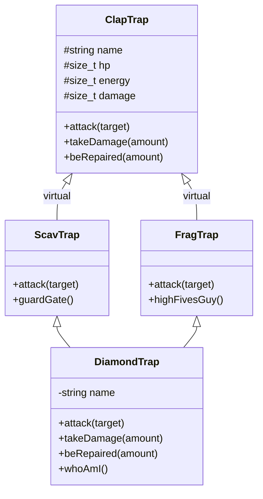

# CPP Module 03 - Inheritance & Polymorphism

[](https://isocpp.org/)
[](https://en.cppreference.com/w/cpp/98)
[](https://en.wikipedia.org/wiki/Object-oriented_programming)
[](https://www.42barcelona.com/)
[]()
[]()

## Descripción

Implementación progresiva de jerarquías de clases en C++98 que demuestra dominio de herencia simple, herencia múltiple y la resolución del **problema del diamante** mediante herencia virtual. Cada ejercicio construye sobre el anterior, culminando en `DiamondTrap`: una clase que hereda de dos padres con una base común sin duplicación de estado.

## Características Principales

- Clase base `ClapTrap` con encapsulamiento de atributos (HP, energía, daño)
- Métodos de acción: `attack()`, `takeDamage()`, `beRepaired()`
- `ScavTrap`: hereda de ClapTrap + método especial `guardGate()`
- `FragTrap`: hereda de ClapTrap + método especial `highFivesGuy()`
- `DiamondTrap`: herencia múltiple con resolución del problema del diamante
- Método introspectivo `whoAmI()` para identificar nombre y nombre ClapTrap
- Librería custom `CuteConsole` para output formateado con colores y emojis
- Sistema de build modular con Makefiles y dependencias automáticas

## Stack Tecnológico

| Tecnología | Propósito |
|------------|-----------|
| C++98 | Estándar del lenguaje |
| g++ | Compilador con flags estrictos |
| GNU Make | Sistema de construcción |
| Virtual Inheritance | Resolución del diamond problem |
| CuteConsole | Librería propia para I/O formateado |

## Decisiones Técnicas

El proyecto demuestra la resolución del **diamond problem**, uno de los desafíos clásicos de la POO en C++. Cuando `DiamondTrap` hereda de `ScavTrap` y `FragTrap` (ambos derivan de `ClapTrap`), se produce ambigüedad: ¿cuál `ClapTrap` hereda? La solución implementada utiliza **herencia virtual** (`virtual public ClapTrap`), asegurando una única instancia de la clase base. Adicionalmente, `DiamondTrap` resuelve ambigüedades de métodos sobrescritos delegando explícitamente a `ScavTrap::attack()`. Esta arquitectura evidencia comprensión profunda de inicialización de miembros virtuales, orden de constructores y diseño de jerarquías robustas.

## Diagrama de Arquitectura



## Estructura del Proyecto

```
CPP-MODULE-03/
├── ex00/
│   ├── src/ClapTrap/
│   ├── src/main.cpp
│   └── lib/cute/
├── ex01/
│   ├── src/ClapTrap/
│   ├── src/ScavTrap/
│   └── lib/cute/
├── ex02/
│   ├── src/ClapTrap/
│   ├── src/ScavTrap/
│   ├── src/FragTrap/
│   └── lib/cute/
└── ex03/
    ├── src/ClapTrap/
    ├── src/ScavTrap/
    ├── src/FragTrap/
    ├── src/DiamondTrap/
    ├── src/main.cpp
    └── lib/cute/
```

## Guía de Instalación

### Requisitos

- g++ con soporte C++98
- GNU Make

### Compilación

```bash
git clone https://github.com/samuelhm/CPP-MODULE-03.git
cd CPP-MODULE-03/ex03
make
./Diamond
```

### Comandos

```bash
make        # Compilar
make clean  # Limpiar objetos
make fclean # Limpiar todo
make re     # Recompilar
```

## Aprendizajes Demostrados

- Herencia simple y múltiple
- Herencia virtual y diamond problem
- Polimorfismo y overriding
- Inicialización de constructores en jerarquías
- Encapsulamiento y abstracción
- Makefiles y gestión de dependencias

## Contacto

[](https://github.com/samuelhm/)
[](https://www.linkedin.com/in/shurtado-m/)

---
*Desarrollado como parte del currículo de 42 Barcelona*