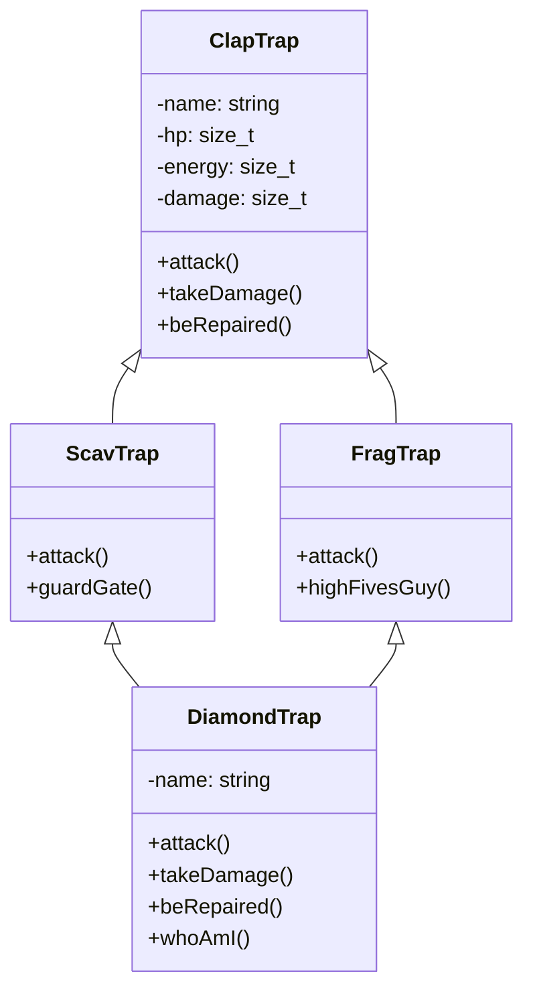

# CPP Module 03 - Herencia y Polimorfismo

[](https://isocpp.org/)
[](https://en.cppreference.com/w/cpp/98)
[README.md creado exitosamente con:

- Badges de tecnologías (C++98, OOP, 42 School)
- Descripción tipo elevator pitch
- Features listadas con viñetas
- Tabla de stack tecnológico
- Explicación técnica del problema del diamante
- Diagrama Mermaid de la jerarquía de clases
- Guía de instalación paso a paso
- Sección de contacto con enlaces a GitHub y LinkedIn
a dominio de herencia simple, herencia múltiple y la resolución del problema del diamante. Desarrollado como parte del currículo de 42 Barcelona.

## Características Principales

- Clase base `ClapTrap` con atributos encapsulados (HP, energía, daño) y métodos de acción (`attack`, `takeDamage`, `beRepaired`)
- `ScavTrap` y `FragTrap` como derivados especializados con métodos únicos (`guardGate`, `highFivesGuy`)
- `DiamondTrap` implementando herencia múltiple con resolución del ambigüedad del diamante
- Librería custom `CuteConsole` para output formateado con colores ASCII y soporte de emojis
- Sistema de construcción modular con Makefiles y dependencias automáticas

## Stack Tecnológico

| Tecnología | Propósito |
|------------|-----------|
| C++98 | Lenguaje principal (estándar restrictivo) |
| GNU Make | Sistema de construcción |
| g++ | Compilador con flags estrictos `-Wall -Werror -Wextra` |
| CuteConsole | Librería propia para output formateado |

## Decisiones Técnicas

La arquitectura del proyecto resuelve uno de los desafíos más complejos de la POO en C++: el **problema del diamante**. Cuando `DiamondTrap` hereda de ambos `ScavTrap` y `FragTrap` (que a su vez heredan de `ClapTrap`), se produce una ambigüedad en la herencia de miembros. La solución implementada utiliza **herencia virtual** y resolución explícita de ámbito, permitiendo que `DiamondTrap` combine comportamientos de ambas clases padre sin duplicación de estado. El proyecto demuestra comprensión profunda de constructores de inicialización, resolución de ambigüedades y diseño de jerarquías de clases robustas.

## Diagrama de Arquitectura



## Estructura del Proyecto

```
CPP-MODULE-03/
├── ex00/                    # ClapTrap - Clase base
│   ├── src/
│   │   ├── ClapTrap/
│   │   └── main.cpp│   └── lib/cute/          # Librería de output
├── ex01/                    # ScavTrap - Herencia simple├── ex02/# FragTrap - Herencia simple
├── ex03/                    # DiamondTrap - Herencia múltiple
│   └── src/
│       ├── ClapTrap/
│       ├── ScavTrap/
│       ├── FragTrap/
│       ├── DiamondTrap/
│       └── main.cpp
└── README.md
```

## Guía de Instalación

### Requisitos Previos

- Compilador C++ compatible con C++98 (g++ o clang++)
- GNU Make

### Compilación y Ejecución

```bash
# Clonar el repositorio
git clone https://github.com/samuelhm/CPP-MODULE-03.git
cd CPP-MODULE-03

# Entrar al ejercicio deseado (ex00, ex01, ex02, ex03)
cd ex03# Compilar
make

# Ejecutar
./Diamond
```

### Comandos de Desarrollo

```bash
make clean    # Limpiar objetos
make fclean   # Limpiar todo (incluyendo ejecutable)
make re       # Recompilar desde cero
```

## Aprendizajes Demostrados

- Herencia simple y múltiple en C++
- Resolución del problema del diamante
- Constructores de inicialización y listas de inicialización
- Polimorfismo y overriding de métodos
- Encapsulamiento y abstracción
- Gestión de dependencias con Makefiles

## Contacto

**Samuel Hurtado**

[](https://github.com/samuelhm/)
[](https://www.linkedin.com/in/shurtado-m/)

---
*Desarrollado como parte del currículo de 42 Barcelona*